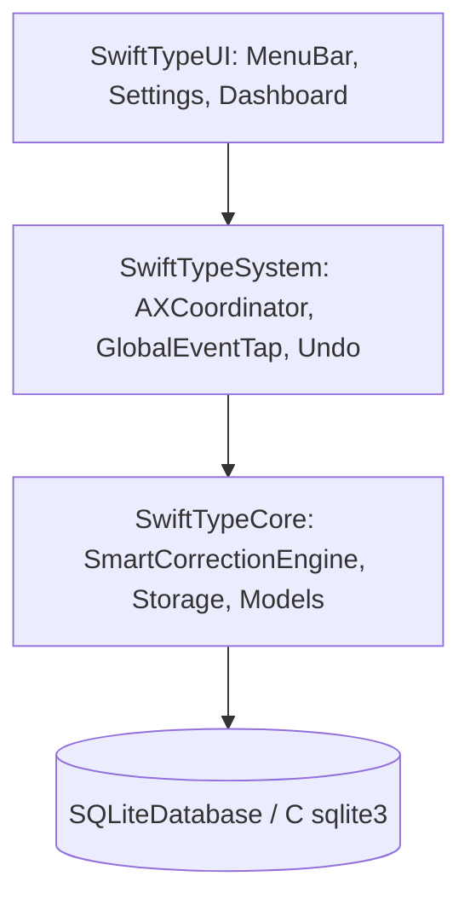

# SwiftType Architecture & Pipeline Design

This document details the internal architecture, algorithms, concurrency model, and data flow of **SwiftType**.

---

## 1. System Module Layering

SwiftType is structured around strict separation of concerns across four modular packages:



### Module Responsibilities:
- **`SwiftTypeCore`**: Pure, platform-independent correction algorithms, metric space indices (`SymSpell`, `BKTree`), QWERTY keyboard distances, dynamic user learning (`AutoLearningManager`), and thread-safe SQLite persistence (`SQLiteDatabase`).
- **`SwiftTypeSystem`**: Low-level macOS integration. Manages Quartz `CGEventTap` (`GlobalEventTap`), Accessibility UI element manipulation (`AccessibilityCoordinator`), and system undo tracking (`UndoManagerService`).
- **`SwiftTypeUI`**: SwiftUI views and `AppKit` controllers for the system status item, productivity charts, preferences, and permissions onboarding.
- **`SwiftType`**: The lightweight application lifecycle glue (`@main SwiftTypeApp` & `AppDelegate`).

---

## 2. The 5-Stage Smart Correction Pipeline

To guarantee $< 5\text{ms}$ latency while maintaining high precision, SwiftType executes candidates through a 5-stage cascade:

```
[Input Word] ──> Stage 1: Exact Match / Exemption Check
                       │ (No -> Short-circuit return original)
                       ▼
                 Stage 2: SymSpell Symmetric Delete ($O(1)$ lookup)
                       │
                       ▼
                 Stage 3: BK-Tree Metric Space Search (Damerau-Levenshtein $d \le 2$)
                       │
                       ▼
                 Stage 4: Rapid Ranking & QWERTY Cost Scoring
                       │
                       ▼
                 Stage 5: Context Validation & Auto-Learning Check
                       │
                       ▼
                 [Selected Correction or Original Word]
```

### Stage 1: Exact Match & Exemption Check
- If the token matches any active dictionary exact entry, user custom word, or regex/casing exemption (e.g., URLs, emails, camelCase variables like `funcName` or `user_id`), the engine immediately short-circuits. Total latency: $\approx 0.05\text{ms}$.

### Stage 2: SymSpell Symmetric Delete ($O(1)$)
- Generates all symmetric deletions of the input word up to edit distance $k=2$.
- Performs instantaneous $O(1)$ hash table lookups to retrieve all dictionary candidates sharing the exact same deletion signatures.

### Stage 3: BK-Tree Metric Space Search
- If SymSpell yields sparse results or complex transpositions, the Burkhard-Keller metric tree (`BKTreeEngine`) traverses dictionary space using Damerau-Levenshtein distance with triangle inequality pruning ($|d(u,v) - d(v,q)| \le k$).

### Stage 4: Rapid Ranking & QWERTY Keyboard Distance Scoring
Candidates from Stages 2 & 3 are ranked by our composite objective score $S(c)$:

\[
S(c) = w_{\text{freq}} \cdot \log(1 + F(c)) - w_{\text{edit}} \cdot D_{\text{DL}}(w, c) - w_{\text{kbd}} \cdot D_{\text{key}}(w, c)
\]

Where:
- $F(c)$ is the normalized corpus frequency of candidate $c$.
- $D_{\text{DL}}(w, c)$ is the Damerau-Levenshtein character distance.
- $D_{\text{key}}(w, c)$ is the Euclidean spatial distance on the standard QWERTY layout (e.g., `'s'` to `'a'` costs $1.0$, while `'z'` to `'p'` costs $8.5$).

### Stage 5: Context Validation & Confidence Filtering
- Evaluates adjacent tokens and checks whether candidate score $S(c)$ exceeds the user-defined `confidenceThreshold` (default $0.95$). If confidence is met, the correction is returned and recorded.

---

## 3. Concurrency & Thread-Safety Model

SwiftType operates in a multithreaded macOS environment where keyboard events arrive on the main run loop while background database writes, analytics, and dictionary indexing run asynchronously.

### Concurrency Guarantees:
1. **Event Tap Execution**: `GlobalEventTap` callbacks run on the main thread via `CFRunLoopAddSource` (`kCFRunLoopCommonModes`) with `kCGEventTapOptionDefault`.
2. **Database Synchronization**: `SQLiteDatabase` serializes all raw `sqlite3` reads and writes via an internal `NSLock`, preventing `SQLITE_BUSY` errors across threads.
3. **Engine Lock isolation**: `SmartCorrectionEngine` and `AutoLearningManager` use reentrant locks (`NSLock`) around dictionary mutations so user additions do not race against active typing events.
4. **Swift 6 Concurrency**: All `AppKit` and `SwiftUI` controllers (`MenuBarController`, `SettingsView`, `StatisticsDashboardView`) are annotated with `@MainActor`.

---

## 4. Accessibility (`AXUIElement`) Replacement Protocol

When `GlobalEventTap` intercepts a word delimiter (`space`, `return`, `tab`, `period`, `comma`), the correction replacement flow executes without disrupting the user's cursor:

1. **Inspect Focus**: `AccessibilityCoordinator.shared` queries `kAXFocusedUIElementAttribute`.
2. **Security Audit**: Checks `kAXRoleAttribute` and `kAXSubroleAttribute`. If `kAXSecureTextFieldSubrole` or password input is detected, replacement is aborted immediately.
3. **String Replacement**:
   - Queries `kAXSelectedTextRangeAttribute` or calculates the character range (`kAXValueCFRangeType`) of the just-typed word.
   - Sets the corrected text directly via `AXUIElementSetAttributeValue(element, kAXSelectedTextAttribute, newText as CFTypeRef)`.
   - Posts synthetic keystrokes only as a fallback if the target application does not support direct `AXSelectedText` attribute mutation.
4. **Undo Window Registration**: Registers the original text with `UndoManagerService`. If `Cmd+Z` (`key code 6` + `Command mask`) arrives within 5 seconds, SwiftType intercepts the event and reverts the word instantaneously.
